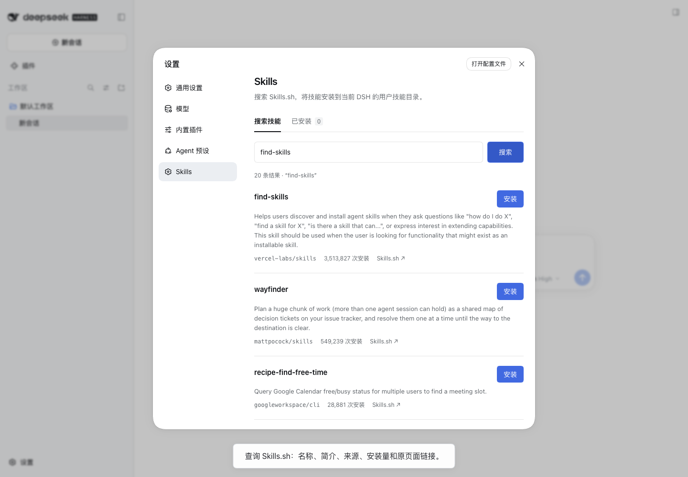

# DSH Skills

在 DSH 设置中搜索、安装和管理 Skills.sh 技能。

```sh
npx --yes @deepseek-ai/dsh@0.1.7-alpha.1 plugin --profile web add github:Zh0uHX/dsh-skills
```

随后运行 `npx --yes @deepseek-ai/dsh@0.1.7-alpha.1 web`，打开 **设置 → Skills**。已有 DSH 进程需要重启。管理技能不需要配置模型 API Key。

[功能演示视频](https://github.com/Zh0uHX/dsh-skills/releases/tag/v0.1.0) · [验收记录](docs/verification.md)



## 使用

输入至少两个字符搜索。结果显示简介、来源、安装量和 Skills.sh 原页面链接。安装完成后，在“已安装”中检查更新、更新或卸载。覆盖安装、更新和卸载均需确认；更新会替换技能目录中的本地修改。

插件只管理自己安装的技能，不接管其他工具写入的目录。当前技能根目录存在同名技能时，安装会中止。项目技能等其他目录中的同名技能，仍可能按 DSH 优先级覆盖它。

## 版本与数据来源

2026-09-22 的兼容基线为 DSH `0.1.7-alpha.1` 和 Skills CLI `1.7.0`。Skills CLI 仅用于核验接口，运行插件无需安装它。当天 npm 的 DSH `latest` 标签仍指向 `0.1.5-rc.2`；安装命令明确指定最新公开 alpha，避免加载不同接口版本。

搜索、简介和文件下载只访问 `skills.sh` / `www.skills.sh`。搜索使用官方 Skills CLI 同样使用的 `/api/search`，下载使用 `/api/download/{owner}/{repo}/{skill}`，无需 API Key。公共接口没有稳定版本保证；格式变化时插件会报错，不会把无效内容写入技能目录。

下载接口提供文本快照，不能保证图片、字体等二进制附件完整。不支持快照下载的域名来源仍可搜索，但安装会明确报错。单个技能最多 256 个文件，单文件 2 MiB，总计 8 MiB。

## 目录与更新

默认写入 `~/.dsh/skills`；设置了 `DSH_HOME` 时使用 `$DSH_HOME/skills`。如果给 DSH 原生 filesystem skill provider 单独配置了 `dshHome`，需要在插件配置中设置相同的 `dshHome`。

每个技能使用来源标识派生的目录名。技能文件、所有权标记、安装记录、锁和暂存目录都在该技能根目录内。拒绝路径穿越、符号链接、重复路径以及文件/目录冲突，不执行下载的脚本。

检查更新比较完整文件内容摘要。下载或提交安装记录失败时保留旧版本；目录切换和记录提交无法组成断电事务；异常退出后的处理见 [故障恢复](docs/recovery.md)。本项目不声称能抵御同一系统用户的恶意进程精确制造的文件系统竞争。

## 开发

Node.js 22 或更新版本：

```sh
npm ci
npm run typecheck
npm test
npm run build
```

`npm run check` 依次执行类型检查、测试和构建。测试使用真实临时目录验证安装、更新、卸载、失败回滚和路径边界，并检查 DSH 请求鉴权与目录数据校验。提交的 `lib/` 是安装入口；GitHub 安装不依赖执行构建脚本。

源码按职责放在 `src/catalog.ts`、`src/store.ts`、`src/index.ts` 和 `src/client.tsx`。开发过程、AI 使用方式与人工输入范围见 [开发记录](docs/development.md)，任务验收条件保留在 [Issues](https://github.com/Zh0uHX/dsh-skills/issues?q=is%3Aissue)。
